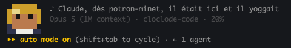

# Cloclode Code



Cloclo en pixel art dans la status line de Claude Code. Il se dandine quand Claude
travaille, bronze quand la fenêtre de contexte se remplit, et sort une phrase par tour
de conversation.

## Installation

```
/plugin marketplace add lozit/cloclode-code
/plugin install cloclode-code@cloclode
/cloclode-code:setup
```

Le plugin déclare déjà une `statusLine` dans son `settings.json` et ses hooks dans
`hooks/hooks.json`. La commande `setup` sert de filet pour une installation hors plugin :
elle écrit les deux dans `~/.claude/settings.json`, avec sauvegarde préalable dans
`settings.json.cloclode.bak`. Elle fusionne avec les hooks déjà présents et ne fait
jamais de doublon.

Les hooks ne sont pas optionnels : sans eux, rien n'écrit l'état de la session, et Cloclo
reste figé sur la première phrase sans jamais se dandiner.

## Les états

| Événement Claude Code | État |
|---|---|
| `SessionStart` | `start` |
| `UserPromptSubmit` | `thinking` |
| `PreToolUse` | `tool` |
| `PostToolUse` (succès) | `tool_done` |
| `PostToolUse` (échec) | `tool_error` |
| `Notification` | `permission` |
| `PreCompact` | `compact` |
| `Stop` | `idle` |

L'état porte deux compteurs, à deux cadences. `tick` avance à chaque événement et fait
bouger les épaules. `turn` n'avance que sur `UserPromptSubmit` et choisit la phrase — une
phrase par tour de conversation, le temps de la lire.

Cloclo se dandine : à chaque événement, une épaule monte d'un pixel pendant que l'autre
descend, puis elles échangent. Le mouvement est indexé sur l'activité et non sur l'horloge,
parce que Claude Code ne relance la status line que quand il se passe quelque chose — au
repos, elle n'est pas rendue du tout, et une animation minutée sauterait au hasard. Cloclo
danse donc quand Claude travaille, et se fige quand c'est calme.

Au-delà de 60 % de fenêtre de contexte, Cloclo bronze : son visage fonce jusqu'à un hâle
cuivré vers 85 %, puis vire au coup de soleil. À 100 %, il est cuit. Les cheveux, la veste
et le col gardent leur couleur — c'est un bronzage, pas un incendie.

## Architecture

- `hooks/hooks.json` — branche chaque événement sur `scripts/hook.mjs`
- `scripts/hook.mjs` — écrit `{state, at}` dans un fichier par session
- `scripts/statusline.mjs` — lit cet état et rend la ligne (aucune dépendance, ~40 ms)
- `scripts/sprite.mjs` — la mascotte, en demi-blocs Unicode et couleurs 24 bits ; un seul
  sprite, dont seule la rangée d'épaules varie
- `scripts/phrases.mjs` — le catalogue des titres
- `scripts/demo.mjs` — rend la ligne hors session, pour voir un changement tout de suite

L'état stocke aussi un compteur `tick`, incrémenté à chaque événement. C'est lui qui fait
avancer l'animation.

L'état est stocké dans `$CLAUDE_PLUGIN_DATA` s'il existe, sinon dans le dossier temporaire
du système. Comme la status line est événementielle, un état peut rester affiché
brièvement après coup — c'est un compagnon, pas un moniteur.

## Ajouter des titres

Tout est dans `scripts/phrases.mjs` : un tableau `PHRASES`, sans rattachement à un état.
Elles défilent dans l'ordre, une par tour.

Une phrase est coupée à la largeur du terminal, avec un `…` final — rien ne déborde, mais
une phrase de N caractères demande un terminal de N + 12 colonnes pour s'afficher en
entier (8 pour le sprite, 2 d'écart, 2 pour le `♪ `). Un emoji compte pour un caractère
mais occupe deux colonnes.

Pour voir le résultat sans attendre qu'une session atteigne l'état voulu :

```
node scripts/demo.mjs tool_error   # un état
node scripts/demo.mjs idle 92      # un état, à 92 % de fenêtre
node scripts/demo.mjs --phrases   # toutes les phrases
node scripts/demo.mjs --heat       # la chauffe, de 0 à 100 %
node scripts/demo.mjs --sway      # six événements d'affilée, pour voir le dandinement
```

Une contrainte à connaître si vous retouchez le sprite : Claude Code rogne les blancs
en tête de chaque ligne de status line. Un pixel transparent en colonne 0 décalerait
la ligne entière d'une colonne vers la gauche — `renderSprite` s'en protège, mais le
plus simple reste de garder la colonne 0 opaque.

## Note sur les droits

Les phrases de `phrases.mjs` sont des textes originaux. Elles ne reprennent **aucun vers
de chanson** : les paroles de Claude François sont protégées et activement défendues par
ses ayants droit, donc n'en ajoutez pas si vous publiez le dépôt. Les titres de chansons
restent utilisables, les paroles non.

Le sprite est un pixel art original, pas un portrait.

## Licence

MIT
